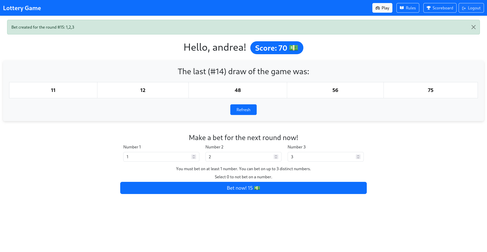
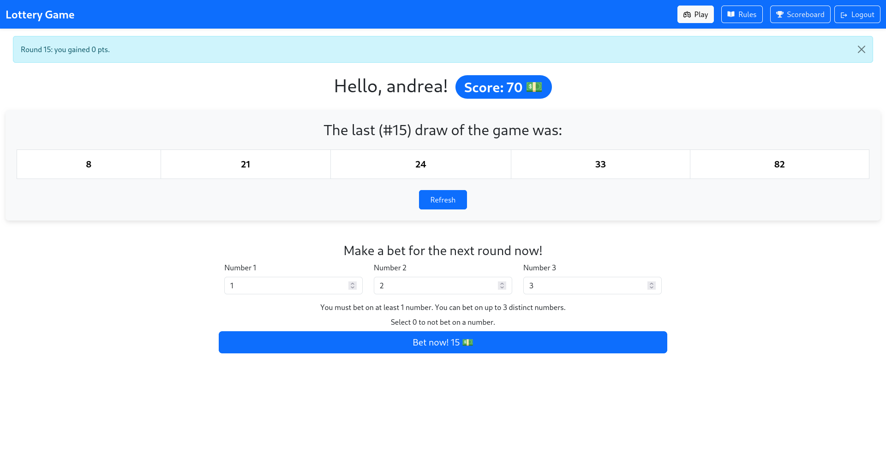

# Exam 3: "Lottery Game"
## Student: s333224 BUONAURIO ANDREA 

## React Client Application Routes
- `/` the homepage of the website. Logged out users can read the rules of the game. Logged-in users can play the game (see the last draw of the game and place a new bet).
- `/login` page used to perform login.
- `/rules` page where logged-in users can read the rules of the game.
- `/scoreboard` this page displays a table with the scores of the top 3 players.
- `/*` handles all invalid URLs. Shows a 404 error message.

## API Server

### __Login__
- URL: `/api/sessions`
- HTTP Method: POST.
- Description: Logs in a user using provided credentials (username and password).
- Request parameters: _None_.
- Request body content: Object with the credentials of the user (username and password).
```
{
  "username": "user",
  "password": "password"
} 
```
- Response: 
  - `200` success
  - `401` wrong credentials
  - `422` if the credentials are malformed
- Response body content: JSON object with the data of the current user _or_ an error message.
```
{
  "user_id": 1,
  "username": "user",
  "score": 100,
} 
```

### __Logout__
- URL: `/api/sessions/current`
- HTTP Method: DELETE 
- Description: Logs out the current user.
- Request parameters: _None_.
- Request body content: _None_.
- Response: 
  - `204` success
- Response body content: _None_.

### __Check login status and retrieve user data__
- URL: `/api/sessions/current`
- HTTP Method: GET 
- Description: Checks if the user is logged-in and retrieves its data.
- Request parameters: _None_.
- Request body content: _None_.
- Response: 
  - `200` success
  - `401` if the user is not logged-in
  - `404` user not found in the database anymore
  - `500` internal server error
- Response body content: JSON object with the data of the current user _or_ an error message.
```
{
  "user_id": 1,
  "username": "user",
  "score": 100,
} 
```

### __Get the last draw of the game__
- URL: `/api/draws/last`
- HTTP Method: GET.
- Description: used by logged-in users to retrieve the latest draw of the game in the database.
- Request parameters: _None_.
- Request body content: _None_.
- Response: 
  - `200` success
  - `401` if the user is not logged-in
  - `500` internal server error
- Response body content: JSON object with the data of the last draw of the game _or_ an error message.
```
{
  "numbers": [1,2,3,4,5],
  "round": 2
} 
```

### __Place a new bet for the next round.__
- URL: `/api/bets`
- HTTP Method: POST.
- Description: used by logged-in user to place a new bet for the next round of the game.
- Response: 
  - `201` success
  - `400` if the player has not enough points to place that bet
  - `401` if the user has not logged-in
  - `409` if the player has already placed a bet for the next round
  - `422` if the bet data is malformed
  - `500` internal server error
- Request parameters: _None_.
- Request body content: Object with the numbers on which the player wants to place a bet.
```
{
  "numbers": [5, 10, 15]
}
```
- Response body content: Object with the data of the new bet created _or_ an error message.
```
{
  "round": 8,
  "user_id": 1,
  "numbers": [5, 10, 15]
}
```

### __Get the results of the user bets.__
- URL: `/api/user/results/unseen`
- HTTP Method: GET 
- Description: used by logged-in users to download the bet results that the user has not viewed yet.
- Request parameters: _None_.
- Request body content: _None_.
- Response: 
  - `200` success
  - `401` if the user has not logged-in
  - `500` internal server error
- Response body content: Array of JSON Objects with the results of the last bets of the user _or_ an error message.
```
[
  {
    "round_num": 8,
    "user_id": 1,
    "score": 0,
    "viewed": 0
  }
]
```

### __Get the scores of the best players of the game.__
- URL: `/api/scores/best`
- HTTP Method: GET 
- Description: used by logged-in user to download the username and scores of the best 3 players in the database.
- Request parameters: _None_.
- Request body content: _None_.
- Response: 
  - `200` success
  - `401` if the user has not logged-in
  - `500` internal server error
- Response body content: array of JSON objects with the username and scores of the top 3 players _or_ an error message.
```
[
  {
    "username": "admin",
    "score": 100
  },
  {
    "username": "user",
    "score": 85
  },
  {
    "username": "andrea",
    "score": 85
  }
]
```

## Database Tables

### users Table
Stores user data such as:
- `user_id`: Unique identifier for each user.
- `username`: User's name.
- `hash`: Password hash.
- `salt`: Password salt.
- `score`: User's current score.

### rounds Table
Tracks game rounds:
- `round_count`: Number of completed rounds.

### draws Table
Stores information about each draw:
- `round_number`: Round for which the draw applies.
- `numbers`: Array of numbers drawn in the round.

### bets Table
Stores players' bets:
- `round_number`: Round for which the bet applies.
- `user_id`: The user who placed the bet.
- `numbers`: Array of numbers the player bet on.

### results Table
Stores results of players' bets:
- `round_number`: Round in which the bet was placed.
- `user_id`: The user who placed the bet.
- `score`: Points scored from the bet.
- `viewed`: Whether the user has seen the results.

## Main React Components
- `Homepage` (in `Homepage.jsx`): defines the layout of the website homepage.
- `NavHeader` (in `NavHeader.jsx`): renders the top navigation bar.
- `LoginForm` (in `AuthComponents.jsx`): provides a form for user login.
- `DisplayLastDraw` (in `DisplayLastDraw.jsx`): displays the latest draw of the game. Retrieves draw data from the game server.
- `BettingForm` (in `BettingForm.jsx`): provides a form for placing a new bet. Sends bet data from the server.
- `GameRules` (in `GameRules.jsx`): displays the rules of the game.
- `NotFound` (in `NotFound.jsx`): renders a 404 error page for undefined routes.
- `Scoreboard` (in `Scoreboard.jsx`): renders a table with the top 3 players usernames and scores. Fetches the data from the server.


## Screenshot



## Users Credentials

| username | plain-text password |
| -------- | ------------------- |
| user     | password            |
| admin    | password            |
| andrea   | password            |
| carmine  | password            |
| simone   | password            |

